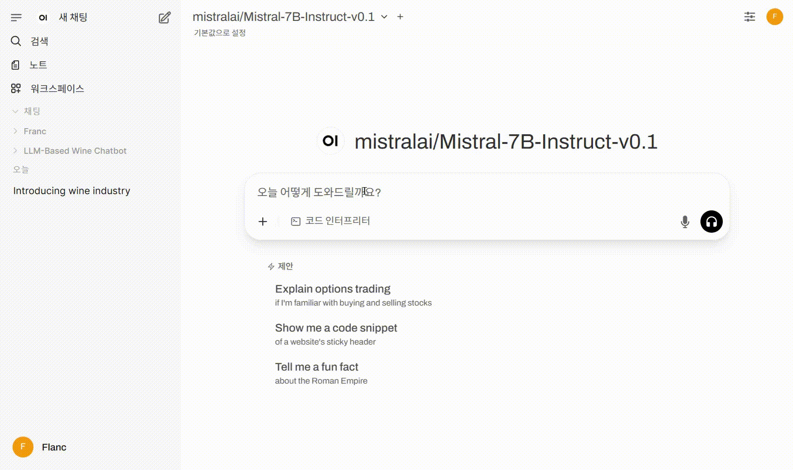

## 🍷 LLM Based Wine Chatbot

**LLM-Based-Wine-Chatbot** is a multi-turn conversational chatbot powered by a locally hosted large language model (Mistral-7B-Instruct).  
It aims to lower the **knowledge-entry barrier** that many beginners face when learning about wine.  
The chatbot is designed to provide accessible, accurate, and friendly guidance for **wine beginners**, while laying the groundwork for future extensions targeting expert users.

## Motivation

Wine is a globally beloved and fascinating beverage. However, it presents various challenges:
- Knowledge-entry barrier (complex terminologies, regional nuances)
- High price and scarcity of renowned wines
- Packaging size(i.e,. 750ml) and risk of spoilage

This project focuses on addressing the **knowledge-entry barrier** using an LLM-based chatbot as a first step.  
By leveraging **prompt engineering**, we have shaped the LLM into a wine expert persona that provides approachable and reliable information.

## Features
- **Multi-turn conversation** with memory (context-aware answers)
- **Prompt engineering** to define a wine expert persona (clear, honest, beginner-friendly)
- **Local LLM (Mistral-7B-Instruct)** deployed initially on local hardware, now served on an **NVIDIA RTX A6000 server**
- **Streamlit UI** with real-time typing simulation
- Modular design for future integration with RAG and visualization systems (e.g., multiple-coordinated views + chatbot)

## Visual Demo
The following demo showcases the **LLM-based wine expert chatbot** in action during multi-turn conversations:

  
<div align="center">
  <b>Fig. 1. Example multi-turn dialogue between a user and the chatbot, illustrating real-time responses.</b>
</div>  
  <br>
  
**Note:** This demo uses a token setting that limits response length.
  <br>

## Future Work
- Expand target users from beginners to experts via **RAG (Retrieval-Augmented Generation)**
- Integrate with wine data visualizations for research (e.g., coordinated views)
- Migrate backend to FastAPI for streaming and production deployment
- Set up SSL (HTTPS) and secure endpoints
- Migrate frontend to React for richer interactivity

## Installation
- chatbot server
```bash
git clone https://github.com/imFlanc/LLM-Based-Wine-Chatbot.git
cd LLM-Based-Wine-Chatbot

python -m venv .venv
.\.venv\Scripts\activate (windows)
source .venv/bin/activate (mac/linux)

pip install -r requirements.txt

pip install open-webui
```

# Run
- server
```bash
python -m uvicorn server:app --reload
```
- open-WebUI - [URL](localhost:8080)
```bash
open-webui serve
```

# Setting
1.  Create a `.env` file in the project root and add your token: `TOKEN=your_token_here`
2. Go to [localhost:8080](localhost:8080) and create an admin account.
3. Navigate to **Profile > Settings > Connections**.
4. Add a new connection with the URL: `http://127.0.0.1:8000/v1`.
5. Save and select the new model from the main chat screen.
